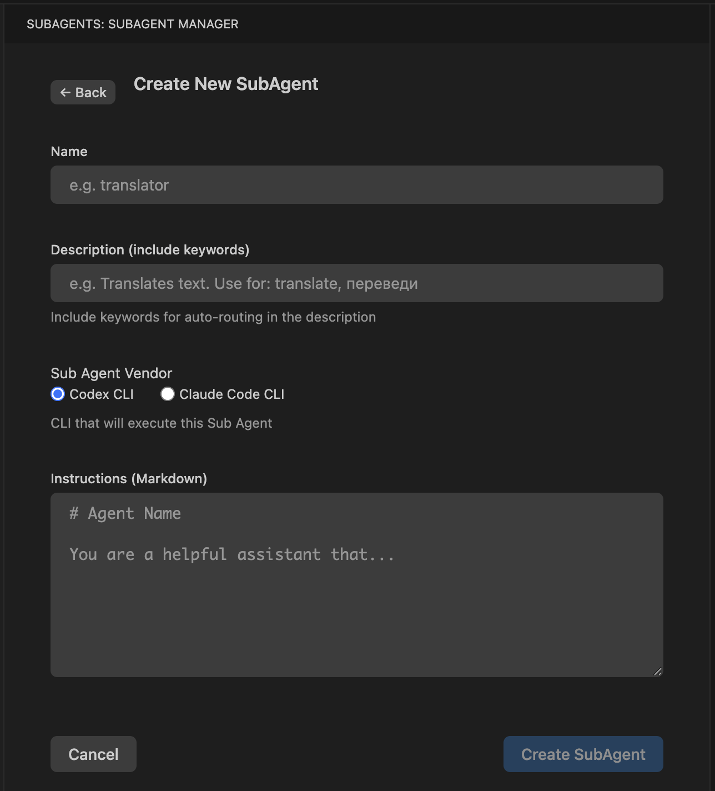

# SubAgent Manager

**VS Code Extension for managing AI Sub-Agents across CLI tools (Codex CLI, Claude Code CLI).**


## Overview

SubAgent Manager lets you create, organize, and deploy specialized AI assistants (Sub-Agents) that work within your existing AI CLI tools. Define an agent once, deploy it everywhere.

### Key Features

- **Visual Editor** — Create and edit SubAgents with a rich UI
- **Library** — Personal collection of reusable SubAgents  
- **Deploy** — One-click deploy to Project or Global scope
- **Multi-CLI** — Works with Codex CLI and Claude Code CLI as Main Orchestrator Agents. Creates SubAgents for either Codex CLI or Claude Code CLI.
- **Interactive Conversation** — SubAgents support full interactive dialogue, not just one-shot responses
- **Focused Execution** — Sub-Agents are launched **ONLY with their specific, narrow instructions**. This ensures they stay focused on the task without the distraction of general chat history or conflicting directives.
- **Real-time Logging (Codex)** — When a Codex SubAgent runs, a Terminal window automatically opens showing full verbose output (thinking, tool calls, exec logs). The Orchestrator receives **only the final answer** to save tokens, while you can observe the full work in real-time.
- **Full Autonomy** — SubAgents run with maximum permissions: Codex uses `--dangerously-bypass-approvals-and-sandbox`, Claude uses `--dangerously-skip-permissions`.
- **Slash Commands** — Auto-generated slash commands for manual SubAgent invocation:
  - Codex CLI: `/prompts:subagent-{name}` (e.g., `/prompts:subagent-translator`)
  - Claude Code: `/subagent-{name}` (e.g., `/subagent-translator`)
- **Auto-Select Command** — Automatically creates `/subagent-auto` command that reminds the Orchestrator Agent to read the manifest and select the appropriate SubAgent
- **Auto-Routing** — The Main Orchestrator Agent receives a workspace-level instruction (in `AGENTS.md` / `CLAUDE.md` under the project root) to review the SubAgents Manifest and automatically delegate tasks to the most suitable SubAgent based on its specialization
- **Import/Export** — Share SubAgents between users via `.subagent` files



## Prerequisites

Before using this extension, ensure you have the following installed and authenticated:

- **Codex CLI**: Required if you plan to use Codex-based Sub-Agents.
- **Claude Code CLI**: Required if you plan to use Claude-based Sub-Agents.

Both tools must be available in your system `PATH` and fully authenticated (logged in).

## Installation

Download the latest `.vsix` release from [Releases](https://github.com/OleynikAleksandr/multicli-subagents/releases) and install in VS Code:

1. In VS Code: `Extensions` → `...` → `Install from VSIX...`
2. Select the downloaded `.vsix` file

## Quick Start

1. **Open** SubAgent Manager from the Activity Bar (MsA icon)
2. **Create** a new SubAgent with name, description, and instructions
   - Select Vendor: `Codex` or `Claude`
3. **Deploy** to Project (current workspace) or Global (all projects)
4. **Use** the SubAgent:
   - **Auto**: Just describe a task matching the SubAgent's description → the Orchestrator will route it
   - **Manual**: Use the generated slash command (e.g., `/subagent-translator`)

### Example: Translator SubAgent

```yaml
Name: translator
Vendor: Codex
Triggers: Translates text and/or files to the specified language
Instructions: |
  You are a professional translator.
  Translate the given text to the requested language.
  Preserve formatting and technical terms.
  Save translations next to the original files with a language prefix.
```

**Workflow:**
1. You ask the Orchestrator: "Translate README.md to Russian".
2. The Orchestrator reads the manifest and finds the `translator` agent.
3. The Orchestrator delegates the task.
4. The Sub-Agent starts with **only the translator instructions**, ensuring focused execution.

## Architecture

```
~/.subagents/                  # Global SubAgents storage
├── manifest.json              # Registry of deployed agents
├── start.sh                   # Universal start script
├── resume.sh                  # Universal resume script
├── subagent.log               # Real-time log (Codex only)
└── {agent}/                   # Agent directory
    └── {agent}.md             # Agent instructions

~/.codex/prompts/              # Codex slash commands
└── subagent-{name}.md         # Individual agent command

~/.claude/commands/            # Claude slash commands  
└── subagent-{name}.md         # Individual agent command

<workspace-root>/              # Per-project routing and commands
├── AGENTS.md                  # Workspace routing instructions for Codex Orchestrator
├── CLAUDE.md                  # Workspace routing instructions for Claude Orchestrator
└── .subagents/ (optional)     # Project-local SubAgents storage (same layout as ~/.subagents/)
```

## Documentation

- [Changelog](CHANGELOG.md)

## License

MIT
